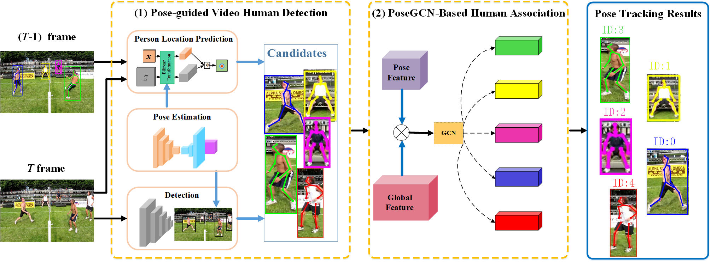

# Pose-Guided Tracking-by-Detection: Robust Multi-Person Pose Tracking


## Introduction
This paper addresses the **multi-person pose tracking task** that aims to estimate and track person pose keypoints in video. We propose a **pose-guided tracking-by-detection framework** which fuses pose information into both video human detection and data association procedures. Specifically, we adopt the **pose-guided single object tracker** to exploit the temporal information for making up missing detections in the video human detection stage. Furthermore, we propose a **hierarchical pose-guided graph convolutional networks (PoseGCN)** based appearance discriminative model in the data association stage. The GCN-based model exploits the human structural relations to boost the person representation.

## Overview
- This the implementation of the ***Pose-Guided Tracking-by-Detection: Robust Multi-Person Pose Tracking***.
- This repo focuses on the major contribtion of our methods.

<div align=center></div>

## Main Results
Results on Posetrack 2017 Datasets comparing with the other methods, the result on Val is **68.4** and on Test is **60.2**, which achieves SOTA.  

<div align=center></div>

## Quick Start
### Install

1. Create an anaconda environment named `PGPT` whose **python ==3.7,** and activate it 

2. Install pytorch==0.4.0 following [official instuction](https://pytorch.org/)

3. Clone this repo, and we'll call the directory that you cloned as `${PGPT_ROOT}`

4. Install dependencies

   ```
   pip install -r requirements.txt
   ```

### Demo
1. Download the [demo dataset](https://drive.google.com/file/d/1V8GosSCpf1WVjjWIg5ZjDKhKFHVJVuTn/view?usp=sharing) and [demo_val](https://drive.google.com/open?id=10_vdN18hajEePO0WAAQTXTO0mKDouEsu), and put them into  the `data` folder in the following manner:

    ```
    ${PGPT_ROOT}
     |--data
         |--demodata
             |--images
             |--annotations
         |--demo_val.json
    ```
    - You can also use your own data in the same data format and data organization as the demo dataset.
2. Download the [PoseGCN model](https://drive.google.com/open?id=1emHrW4OFFOndmR5OIUfHDq4xf8yhdPjR) and [Tracker model](https://drive.google.com/open?id=1FSWm3nmjvXUxjKayGlXULcP9ne6S3DQ7), and put them into the `models` folder in the following manner:

    ```
    ${PGPT_ROOT}
     |--models
         |--pose_gcn.pth.tar
         |--tracker.pth
    ```


3. Download the results of detection for demo, and put the results  in the `results` in the following manner
   - Right now we don't provide the detection and the pose model which we implement. We implement the module based on the [Faster RCNN](https://github.com/rbgirshick/py-faster-rcnn) for detection model and [Simple Baseline](<https://github.com/microsoft/human-pose-estimation.pytorch>) for pose estimation model. You can clone their repo and train your own detection and pose estimation module. 
   
   - In order to smoothly run the demo, we provide [`demo_detection.json`](https://drive.google.com/open?id=1Jvfin7M7qgoO6k3rpkR2Yc4Kcp2iuTR9) which is the demo results of our detection model. Meanwhile, you can run the demo with your own detection results in the same format as `demo_detection.json`. 
   
     ```
      ${PGPT_ROOT}
       |--results
       	  |--demo_detection.json
     ```
   
     
   
4. You can run the demo by the following codes:
    ```
    cd ${PGPT_ROOT}
    sh demo.sh
    ```
    - Store the JSON results on the `${PGPT_ROOT}/results/demo`
	- Store the  results on the `${PGPT_ROOT}/results/render`

### Note

- You can modify the `inference/config.py` to suit the path of your own.
- We  still arrange the project of our method, and we will release the  whole project later. 

### Citation
If you use this code for your research, please consider citing:

@InProceedings{TMM2020-PGPT,/
title = {Pose-Guided Tracking-by-Detection: Robust Multi-Person Pose Tracking},/
author = {Q. Bao, W. Liu, Y. Cheng, B. Zhou and T. Mei},/
booktitle = { IEEE Transactions on Multimedia},/
year = {2020}
}
